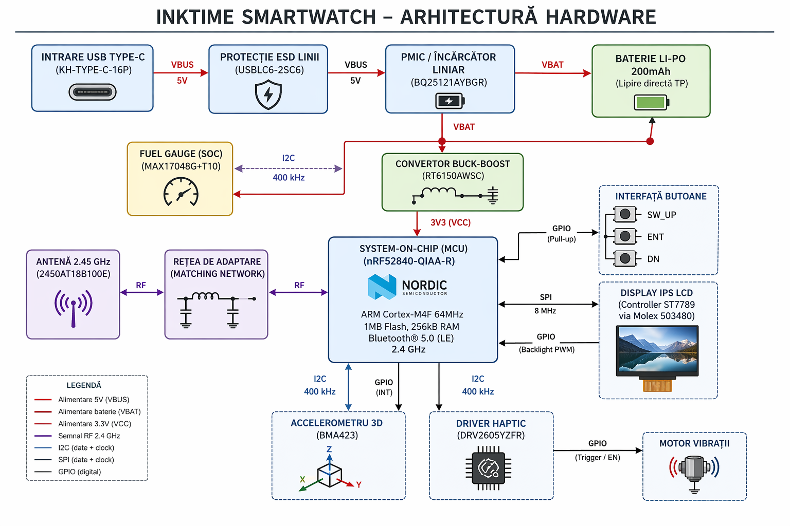

# Documentație de Arhitectură și Inginerie Hardware: Sistemul Wearable InkTime

## 1. Introducere

Proiectul InkTime reprezintă o inițiativă tehnologică ambițioasă de a dezvolta un smartwatch open-source, optimizat pentru costuri reduse și manufacturabilitate la scară largă, fără a face compromisuri în ceea ce privește fiabilitatea sau performanța.

### 1.1. Structura Proiectului

- **Hardware/**: Găzduiește definițiile fundamentale ale circuitului. Aici se regăsesc fișierul schematic (.sch), alături de fișierul board-ului (.brd).
- **Manufacturing/**: Conține arhiva esențială pentru fabrica de PCB-uri (gerbers.zip), care include straturile de cupru, măștile de lipire (solder mask), stratul de inscripționare (silkscreen) și fișierele de găurire (Excellon drill files). De asemenea, acest director include fișierul Bill of Materials (.bom), detaliind componentele utilizate, și fișierul Pick and Place (.cpl), care mapează coordonatele carteziene (X, Y) și rotația fiecărei componente pentru echipamentele automate de asamblare.
- **Mechanical/**: Include modelul 3D integrat al dispozitivului în format .step și format nativ Fusion360. Acest model cuprinde PCB-ul populat cu componente, geometria exactă a bateriei Li-Po, ecranul LCD, motorul haptic (shaker) și șasiul carcasei într-o vizualizare detaliată de tip "exploded view".
- **Images/**: Un director vizual care conține randări fotorealiste ale PCBA-ului (Printed Circuit Board Assembly) și ilustrează modul de potrivire mecanică a plăcii în carcasă, servind drept ghid vizual pentru procedurile de asamblare manuală.

## 2. Arhitectura de Sistem și Diagrama Bloc

Filosofia de design a smartwatch-ului InkTime se bazează pe o topologie modulară, distribuită în jurul unui nod central de procesare (System-on-Chip). Diagrama bloc de mai jos ilustrează interconectarea magistralelor de date, a traseelor de putere și a modulelor periferice. Sistemul este împărțit în patru domenii funcționale majore: Domeniul de Putere (Power Tree), Domeniul de Procesare și Comunicație RF, Domeniul Senzorial și Domeniul Interfeței cu Utilizatorul (UI/HMI).

Fluxul de operare este dictat de nRF52840, care gestionează stările de energie (Power States) ale întregului sistem. Modulul comunică asincron prin magistrala I2C (Inter-Integrated Circuit) cu senzorii (BMA423 pentru detecția mișcării, MAX17048 pentru starea bateriei, DRV2605 pentru feedback haptic) și sincron prin magistrala SPI (Serial Peripheral Interface) cu ecranul LCD. Etajul de alimentare separă procesul de încărcare (gestionat autonom de BQ25121A) de procesul de reglare a tensiunii (gestionat de RT6150AWSC), asigurând o tensiune logică de 3.3V indiferent de nivelul de descărcare al bateriei.

## 3. Bill of Materials (BOM)
Realizarea unui dispozitiv de masă la un cost competitiv impune o selecție a componentelor ancorată puternic în realitățile lanțului de aprovizionare (Supply Chain). Toate componentele majore au fost selectate din biblioteca producătorului asiatic JLCPCB, favorizând componentele "Basic" sau "Extended" aflate constant în stoc, evitând astfel întârzierile de aprovizionare.

De asemenea, pachetele fizice (footprints) au fost alese pentru a permite un asamblaj automatizat de mare viteză pe mașinile Pick and Place, respectând totodată cerința impusă de a utiliza exclusiv pachete SMD (Surface Mount Device).

| Componentă        | Descriere funcțională                                                                                      | JLCPCB Part #    | Link JLCPCB | Datasheet                                                                                                                                                                                                  |
| ----------------- | ---------------------------------------------------------------------------------------------------------- | ---------------- | ----------- | ---------------------------------------------------------------------------------------------------------------------------------------------------------------------------------------------------------- |
| nRF52840-QIAA-R   | System-on-Chip (SoC) ARM Cortex-M4F 64MHz, transceiver Bluetooth 5.0, 1MB Flash, 256KB RAM, pachet AQFN-73 | C190794          | [Link JLCPCB](https://jlcpcb.com/partdetail/NordicSemicon-NRF52840_QIAAR/C190794) | [https://files.seeedstudio.com/wiki/XIAO-BLE/Nano_BLE_MCU-nRF52840_PS_v1.1.pdf](https://files.seeedstudio.com/wiki/XIAO-BLE/Nano_BLE_MCU-nRF52840_PS_v1.1.pdf)                                             |
| MAX17048G+T10     | Fuel Gauge pentru baterii Li-Ion (1 celulă), algoritm ModelGauge, interfață I2C, pachet TDFN-8             | C2682616         | [Link JLCPCB](https://jlcpcb.com/partdetail/C2682616) | [https://www.analog.com/media/en/technical-documentation/data-sheets/max17048-max17049.pdf](https://www.analog.com/media/en/technical-documentation/data-sheets/max17048-max17049.pdf)                     |
| BMA423            | Accelerometru MEMS triaxial, 12 biți, step counter hardware, pachet LGA-12                                 | C189517          | [Link JLCPCB](https://www.lcsc.com/product-detail/C189517.html) | [https://watchy.sqfmi.com/assets/files/BST-BMA423-DS000-1509600-950150f51058597a6234dd3eaafbb1f0.pdf](https://watchy.sqfmi.com/assets/files/BST-BMA423-DS000-1509600-950150f51058597a6234dd3eaafbb1f0.pdf) |
| DRV2605YZFR       | Driver haptic smart-loop pentru motoare ERM/LRA, librărie Immersion, pachet DSBGA-9                        | C81079           | [Link JLCPCB](https://www.lcsc.com/product-detail/C81079.html) | [https://www.ti.com/lit/ds/symlink/drv2605.pdf](https://www.ti.com/lit/ds/symlink/drv2605.pdf)                                                                                                             |
| BQ25121AYBGR      | PMIC + încărcător Li-Po ultra low power (max 300mA), Ship Mode, pachet DSBGA-25                            | C111776          | [Link JLCPCB](https://jlcpcb.com/parts) | [https://www.ti.com/lit/ds/symlink/bq25121a.pdf](https://www.ti.com/lit/ds/symlink/bq25121a.pdf)                                                                                                           |
| RT6150AWSC        | Convertor DC-DC buck-boost (1.8V–5.5V → 3.3V), curent max 800mA, consum idle 60µA                          | C147971          | [Link JLCPCB](https://www.lcsc.com/product-detail/C147971.html) | [https://www.richtek.com/assets/product_file/RT6150A=RT6150B/DS6150AB-04.pdf](https://www.richtek.com/assets/product_file/RT6150A=RT6150B/DS6150AB-04.pdf)                                                 |
| KH-TYPE-C-16P     | Conector USB Type-C mamă, 16 pini, SMD, profil redus, 3A                                                   | C709357          | [Link JLCPCB](https://jlcpcb.com/partdetail/KH-TYPE-C-16P/C709357) | N/A                                                                                                                                                                                                        |
| USBLC6-2SC6       | Protecție ESD (TVS diode array), capacitance 2.5pF pentru linii USB                                        | C7519 / C2827654 | [Link JLCPCB](https://jlcpcb.com/partdetail/STMicroelectronics-USBLC62SC6/C7519) | [https://www.st.com/resource/en/datasheet/usblc6-2.pdf](https://www.st.com/resource/en/datasheet/usblc6-2.pdf)                                                                                             |
| Molex 503480-2400 | Conector ZIF FPC/FFC 24 pini, pitch 0.5mm, low profile (1.0mm)                                             | C234192          | [Link JLCPCB](https://www.lcsc.com/product-detail/C234192.html) | [https://www.mouser.com/datasheet/2/276/3/5034802400_FFC_FPC_CONNECTORS-2853339.pdf](https://www.mouser.com/datasheet/2/276/3/5034802400_FFC_FPC_CONNECTORS-2853339.pdf)                                   |
| 2450AT18B100E     | Antenă ceramică RF 2.45 GHz, eficiență ~76%, pachet SMD 1206                                               | C2836414         | [Link JLCPCB](https://jlcpcb.com/partdetail/JohansonTechnology-2450AT18B100/C2836414) | [https://www.johansontechnology.com/docs/1187/2450AT18B100_X8XXogU.pdf](https://www.johansontechnology.com/docs/1187/2450AT18B100_X8XXogU.pdf)                                                             |

## 4. Descrierea Exhaustivă a Funcționalității Hardware
Sistemul hardware a fost proiectat având ca prioritate absolută optimizarea balanței dintre performanța de calcul, capacitatea de interacțiune umană fluidă și un consum energetic de tip "ultra-low power". Modul în care aceste subsisteme interacționează determină direct fezabilitatea comercială a smartwatch-ului InkTime.
### 4.1. Nucleul de Procesare și Comunicație RF (nRF52840)
La baza sistemului se află integratul nRF52840-QIAA-R, un System-on-Chip (SoC) hibrid care combină logica unui microcontroler cu un transceiver radio de mare performanță. Funcționând la o frecvență de bază de 64 MHz, nucleul ARM Cortex-M4 include o unitate de calcul în virgulă mobilă (FPU - Floating Point Unit), esențială pentru procesarea accelerată a datelor senzoriale tridimensionale (cum ar fi cele generate de BMA423) și randarea elementelor grafice pe afișaj. Dispune de 1 MB memorie Flash internă și 256 KB memorie SRAM. Spațiul generos de memorie Flash permite integrarea sistemelor de operare de tip RTOS (precum Zephyr, frecvent utilizat în comunitatea open-source smartwatch) și implementarea de actualizări Over-The-Air (OTA) sigure.

Componenta de radiofrecvență a SoC-ului este extrem de performantă, suportând tehnologia Bluetooth 5.0 Low Energy (BLE), alături de protocoale precum Thread, Zigbee și rețele proprietare de 2.4 GHz. Dispozitivul are o sensibilitate de recepție de -95 dBm la 1 Mbps și poate emite semnale la o putere configurabilă de la -20 dBm până la +8 dBm. Această versatilitate asigură că ceasul poate menține o legătură stabilă cu un terminal mobil (ex. smartphone) chiar și în medii electromagnetice congestionate, minimizând totodată consumul bateriei adaptând puterea de transmisie. Securitatea pachetelor de date BLE este garantată de coprocesorul intern ARM TrustZone CryptoCell 310, care realizează criptare hardware AES/ECB asincron, degrevând procesorul principal.

Antena ceramică tip SMD (2450AT18B100E) este montată la extremitatea plăcii și este un dispozitiv de tip LTCC (Low Temperature Co-fired Ceramic), proiectat de Johanson Technology. Oferind o eficiență de 76%, antena necesită un design restrictiv al planului de masă pentru a nu-și altera impedanța caracteristică de 50 Ohmi.

### 4.2. Topologia de Alimentare și Managementul Bateriei (Power Delivery Network)

Tensiunea unei baterii clasice Litiu-Polimer (Li-Po) fluctuează considerabil în timpul ciclului său de descărcare, de la o valoare maximă de ~4.2V (complet încărcată) până la o tensiune de cut-off de aproximativ 3.0V. Pentru ca ecranul IPS și procesorul să ruleze constant, au nevoie de o sursă stabilă de energie. Aici intervine arhitectura "Power Tree" a dispozitivului InkTime.

### Etajul de Încărcare și Protecție (BQ25121A și USBLC6-2SC6):

Energia pătrunde în sistem prin intermediul conectorului KH-TYPE-C-16P, o versiune orizontală SMD care susține curenți nominali ridicați și care a fost preferată pentru profilul său plat. Liniile de date și alimentare ale portului USB sunt expuse mediului extern, devenind vulnerabile la descărcări electrostatice (ESD). Circuitul USBLC6-2SC6, conectat imediat după port, clamp-ează aceste tensiuni tranzitorii violente (clamping voltage de 17V) redirecționându-le în masă. Cu o capacitanță parazită de numai 2.5pF, acest cip nu degradează integritatea semnalului.

Tensiunea de 5V preluată (VBUS) este apoi rutată către circuitul de management al bateriei BQ25121AYBGR. Acest IC ultra-integrat a fost selectat în detrimentul soluțiilor clasice (precum TP4056) datorită capabilităților avansate de gestionare I2C și a unui consum de repaus (quiescent current) neglijabil. BQ25121A poate încărca bateria cu un curent controlat (maxim 300 mA), implementând ciclul standard CC-CV (Constant Current / Constant Voltage), dar mai important, dispune de un "Ship Mode". Prin activarea acestui mod, ceasul poate fi complet deconectat electronic de la baterie în timpul transportului și stocării în depozite, scăzând consumul bateriei sub 50nA, eliminând astfel riscul ca produsul să ajungă la consumator cu bateria "moartă".

### Etajul de Reglare a Tensiunii (RT6150AWSC):

Întreaga placă electronică funcționează la tensiunea standard de 3.3V (VCC / 3V3). Pentru a prelua variația bateriei de la 3.0V la 4.2V și a furniza constant 3.3V fără a disipa restul de putere ca pierdere termică (așa cum ar face un regulator liniar LDO), a fost integrat convertorul DC-DC Buck-Boost RT6150AWSC. Frecvența sa de comutație de 1 MHz permite utilizarea unor componente pasive magnetice (inductoare) mult mai mici, vitale pentru un design de tip smartwatch. Convertorul dispune de un "Power Save Mode" (PSM), care, în perioadele de consum redus, își scade frecvența de operare și trage din baterie un curent pasiv de doar 60 µA, menținând eficiențe mari la curenți mici.

### Monitorizarea Autonomiei (MAX17048G+T10):
În mod tradițional, monitorizarea capacității unei baterii implică inserarea unui rezistor tip "shunt" (coulomb counter) pe traseul de retur, ceea ce introduce pierderi resistive constante. InkTime utilizează integratul MAX17048G+T10. Acest fuel-gauge citește exclusiv tensiunea celulei (VCELL) și folosește un model matematic proprietar (ModelGauge™) pentru a estima Starea de Încărcare (State-of-Charge / SOC) cu o toleranță a erorii extrem de redusă, raportând datele către nRF52840 pe magistrala I2C. Prin eliminarea rezistorului de măsurare și o stare internă "Hibernate" în care consumă doar 3 µA, se economisește spațiu vital pe PCB și energie prețioasă.

### 4.3. Subsistemul de Afișare (Display Controller ST7789)

Interfața vizuală constituie cel mai solicitant mediu de comunicare din cadrul dispozitivului. Un ecran tipic LCD IPS de mici dimensiuni este comandat prin intermediul integratului ST7789, un driver larg susținut în mediul sistemelor de operare open source pentru embedded (ex: ecosistemul Zephyr Project). Conectivitatea mecanică între ecran (care va fi asamblat în carcasă superioară) și placa de bază (PCB) de grosime 1.0mm se efectuează cu ajutorul unui cablu flexibil plat (FPC). S-a optat pentru utilizarea conectorului Molex 503480-2400. Acest conector ZIF cu 24 de poziții are un pas ultra-fin (pitch) de 0.5mm și cel mai important, o înălțime de la placa de circuit de numai 1.0mm, respectând constrângerile mecanice riguroase pe axa Z din interiorul carcasei. Dispunând de contacte pe ambele planuri (dual contact), facilitează rutarea fără constrângeri privind orientarea benzii flexibile a display-ului.
Afișajul comunică cu nRF52840 prin protocol SPI, necesitând lățimi de bandă substanțiale pentru a randa o grafică fluidă la rezoluția tipică (ex: 240x240 pixeli cu 16 biți adâncime de culoare). O viteză de tact SPI de cel puțin 8 MHz este crucială pentru a preveni fragmentarea imaginilor (tearing effect).

### 4.4. Modulul Senzorial (Accelerometrul BMA423)
Pentru monitorizarea cinematică a purtătorului s-a implementat accelerometrul MEMS digital BMA423, proiectat de Bosch Sensortec. Acest senzor din clasa senzorilor "inteligenți" a fost creat special pentru industria wearable. În locul eșantionării constante și transferării a mii de pachete de date brute (Raw Acceleration Data) pe magistrala I2C către MCU – proces ce ar drena rapid bateria – BMA423 dispune de logică procesuală internă.
Funcția sa nativă de pedometru (Step Counter) analizează algoritmic tiparele de accelerație și numără pașii independent, menținând un consum total de putere redus până la pragul de 13 µA – 25 µA. Informația este stocată într-un buffer intern (FIFO de 1 kByte) de unde poate fi interogată ocazional de MCU. Suplimentar, funcțiile hardware de recunoaștere a mișcării identifică acțiunile de ridicare a brațului spre ochi ("Tilt-on-Wrist") sau bătăi ("Tap/Double Tap") și emit un impuls asincron pe un pin de întrerupere dedicat (INT), ordonând procesorului nRF52840 să iasă din modul System OFF/ON Sleep.

### 4.5. Feedback Haptic Avansat (DRV2605YZFR)

Alerta tactilă a utilizatorului trebuie să fie precisă, evitându-se "zgomotul" tactil al motoarelor dezechilibrate tradiționale. Implementarea include integratul DRV2605YZFR de la Texas Instruments, un driver haptic de înaltă finețe în pachet miniatural DSBGA (chip-scale package). Acest circuit, comunicând prin I2C, integrează o arhitectură de control "Smart-Loop" ce scurtează masiv timpii de accelerare (Startup Time ~ 0.7ms) și frânare ai motorului.
Mecanismul intern monitorizează constant forța contra-electromotoare (BEMF) indusă de motor pe liniile de acționare. Printr-o secvență de calibrare automată, DRV2605 detectează frecvența de rezonanță mecanică a actuatoarelor de tip LRA (Linear Resonant Actuator) și le acționează precis pe acea frecvență, extrăgând forță vibratorie dublă și economisind până la 50% din energia pe care ar fi risipit-o un driver liniar clasic cu punte H. Integratul include o memorie pre-încărcată cu peste 100 de efecte tactile licențiate de compania Immersion, permițând dezvoltatorilor software să selecteze simplu (via I2C) profilul de vibrație dorit (e.g., un „click” scurt de confirmare, o vibrație lungă de alertă), în loc să folosească comutații PWM manuale de la microcontroler. Când nu rulează nicio secvență, consumul driver-ului decade la sub 2 µA.

## 5. Alocarea și Justificarea Mapării Pinilor la nRF52840

SoC-ul nRF52840 oferă o matrice flexibilă (crossbar) pentru alocarea funcțiilor periferice (I2C, SPI, UART, PWM) către majoritatea pinilor GPIO. Cu toate acestea, această libertate este guvernată de reguli fizice imuabile detaliate în Specificațiile de Produs Nordic. Anumiți pini (e.g. P0.02, P0.03, P0.30, P1.15 etc.) sunt clasați arhitectural ca "Standard drive, low frequency I/O only", fiind optimizați exclusiv pentru semnale care nu depășesc 10 kHz. Ignorarea acestei limitări și forțarea unor magistrale rapide (cum ar fi clock-ul SPI la 8 MHz) pe acești pini va conduce la distorsiuni de formă a undei, diafonie radio (interferențe cu semnalul BLE de 2.4GHz) și emisii electromagnetice care pot eșua un test de certificare FCC/CE.

## 6. Analiza Bugetului Energetic și Estimarea Autonomiei Bateriei
Pentru a garanta că proiectul InkTime reprezintă o alternativă fezabilă pe piață, trebuie obținut un echilibru delicat între volumul intern restrâns al dispozitivului – care dictează utilizarea unei baterii Li-Po miniaturale de aproximativ 200 mAh (tensiune nominală 3.7V, tensiune maximă 4.2V) – și consumul diverselor componente electronice.

Mai jos prezentăm un calcul teoretic detaliat al consumului, divizat în cele două stări absolute de utilizare: Starea de Repaus (Sleep Mode) și Starea Activă (Peak Load). Calculele sunt preluate din informațiile stricte oferite de foile de catalog oficiale (Datasheets).

### 6.1. Consumul în Modul de Repaus (System Sleep State)

Un smartwatch își petrece covârșitor de mult timp (cca. 90-95%) cu ecranul oprit, procesând strict algoritmi secvențiali minori și menținând conectivitatea Bluetooth de bază (Advertising). Această stare, numită System_ON_Sleep pentru arhitectura nRF52840, păstrează memoria RAM alimentată și rulează ceasul de timp real (RTC).ComponentăConsum Tipic de RepausCondiție de Operare / JustificarenRF52840 SoC~1.5 µASystem ON mode, Wake-on-RTC, menținere parțială a RAM-ului activ. CPU în starea WFI (Wait For Interrupt).nRF52840 Radio BLE~3.8 µACurent mediu integrat pentru evenimente recurente scurte (pulsuri) de BLE Advertising (la interval de 10 secunde).BMA423 Senzor Accel.13.0 µAÎn modul "Low-Power", senzorul eșantionează frecvențe reduse (ex. 50 Hz). Logică de detecție hardware (Step Counter & Tilt-on-wrist) continuă să opereze neîncetat.MAX17048 Fuel Gauge3.0 µAAflat în "Hibernate Mode". ADC-ul este activat rar pentru a evalua căderea naturală a tensiunii, restul circuitelor de analiză fiind oprite.DRV2605 Driver Haptic1.75 µAStarea de Standby complet (Shutdown Current). Logică I2C latentă.BQ25121A Încărcător0.7 µA (700 nA)Curentul de scurgere (Leakage/Quiescent) generat când mufa USB este deconectată și circuitul intern monitorizează tensiunea de VBAT.RT6150AWSC DC-DC60.0 µACurentul quiescent nativ al etajului Buck-Boost, necesar pentru susținerea comutației minime pe linia logică de 3.3V (Power Save Mode).Curenți Reziduali (PCB)~10.0 µAPierderi minore provocate de curentul de scurgere al condensatoarelor ceramice (Dielectric Leakage) și rezistențelor de pull-up I2C.TOTAL SLEEP BUDGET~93.75 µA (0.093 mA)Un consum consolidat care confirmă performanța uimitoare a sistemelor electronice moderne miniaturale.

### 6.2. Consumul în Modul Activ (Peak Load State)

În scenariul în care utilizatorul privește ecranul, se transferă volume mari de date prin Bluetooth, iar motorul de vibrații este acționat, curentul prezintă vârfuri substanțiale.ComponentăConsum Peak (Vârf)Condiție de Operare / JustificareST7789 Display (LCD + LED) ~20.0 mA - 25.0 mAConsumul major este dominat exponențial de funcția BACKLIGHT. Aprinderea matricei LED la un nivel MID-HIGH va irosi curent imens sub formă luminoasă. Logica de control a panoului IPS contribuie suplimentar.nRF52840 (CPU + Radio)4.8 mA - 15.0 mATransmiterea BLE continuă (0 dBm TX power) absoarbe ~4.8 mA. Trecerea datelor video prin interfața SPI adaugă o sarcină de procesare pe CPU care generează spike-uri adiționale de până la 15 mA.BMA423 Senzor Accel.150 µA (0.15 mA)Operare continuă (Full Data Polling) de înaltă rezoluție (ex. recunoaștere complexă a gesturilor).DRV2605 + Motor LRA/ERM60.0 mA - 80.0 mAConsum tranzitoriu de mare amploare necesar demarării rotorului excentric sau punerii în vibrație a masei rezonante.TOTAL ACTIVE BUDGET~85.0 mA - 120.0 mA(Valorile sunt dependente direct de tipul efectelor Haptic cerute și intensitatea Backlight-ului).Notă privind eficiența: Sursa RT6150 convertor DC-DC suferă o penalizare de eficiență energetică la conversia de tensiune (uzual eficiență ~90%). Prin urmare, extragerea a 100mA la nivelul liniilor de 3.3V va "trage" aproximativ 110mA-115mA de la celula bateriei Li-Po.